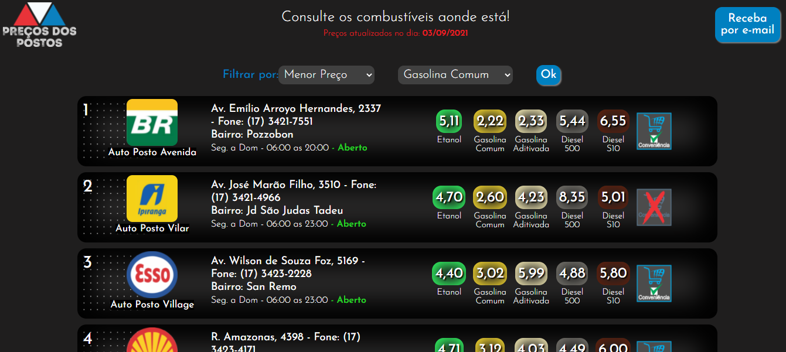

# WebSite de pesquisa de preços dos combustíveis de uma cidade

- O objetivo é solucionar o problema dos cidadãos de uma cidade, que desejam saber o preço de combustível de uma determinada gasolina, alcool ou diesel. 
- Site Totalmente responsivo.

## Tecnólogia utilizada:
- JavaScript
- HTML5
- CSS3
- Sheets(Papel de criar um arquivo em 'xlsx' para enviar toda semana os preços atualizados para quem se inscreve no site)

OBS: Tem muitas melhorias a serem feitas no site, porém o objetivo é apenas demonstrar a arquitetura do site e meus conhecimentos em JavaScript no começo do meu estudo. 
